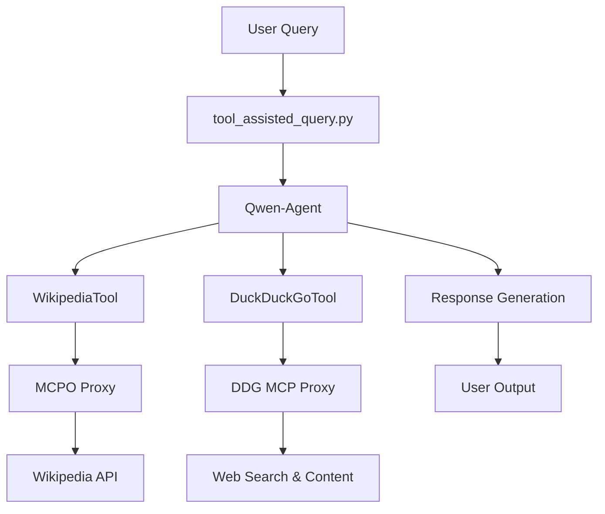
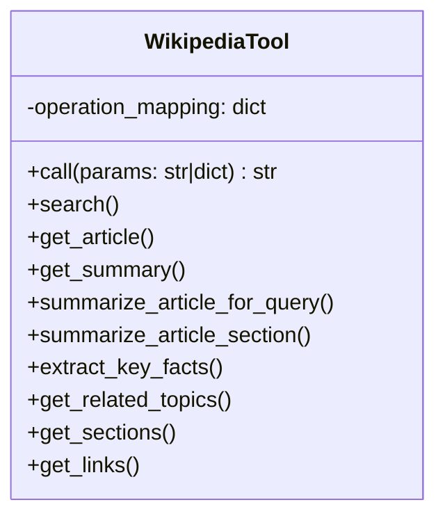
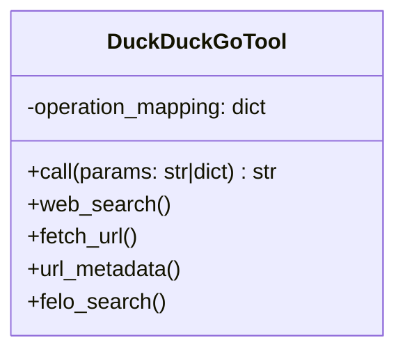
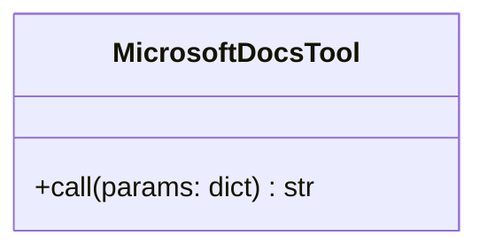

# Tool-Assisted Query System

This project implements a tool-assisted query system using Qwen-Agent and custom tools. The system allows users to perform complex queries that leverage external data sources through a Docker-based environment.

## System Architecture



## Components

### 1. tool_assisted_query.py
The main entry point that:
- Configures the Qwen-Agent with custom tools
- Handles query execution with retry logic
- Manages communication with the Ollama LLM service

Key features:
- Configurable temperature settings for thinking vs. response modes
- Automatic retry mechanism for handling transient errors
- Environment variable configuration (USER_PROMPT, ENABLE_THINKING)

### 2. WikipediaTool (wikipedia_tool.py)
A custom tool that provides access to Wikipedia data through an MCPO proxy. It supports multiple operations:



The tool handles:
- Parameter normalization for different operation types
- Automatic mapping to the appropriate MCPO endpoint
- Error handling for unsupported operations

### 3. Docker Environment
The system runs in a Docker container with the following configuration:

**Dockerfile:**
- Based on Python 3.10-slim
- Installs dependencies from requirements.txt
- Sets entrypoint to run tool_assisted_query.py

**docker-compose.yml:**
- Builds the tool-runner service
- Configures environment variables:
  - `USER_PROMPT`: Default query
  - `ENABLE_THINKING`: Thinking mode toggle

### 4. DuckDuckGoTool (duckduckgo_tool.py)
A custom tool that provides access to DuckDuckGo search and web content through an MCP proxy. It supports multiple operations:



The tool handles:
- Unified interface for all DuckDuckGo operations
- Automatic endpoint mapping
- Error handling for unsupported operations

### 5. MicrosoftDocsTool (microsoft_docs_tool.py)
A custom tool that provides access to Microsoft documentation search through an MCP proxy.



The tool handles:
- Simple interface for Microsoft Docs search
- Direct mapping to MCP endpoint
- Error handling for failed requests

### 6. Dependencies (requirements.txt)
- qwen-agent: Core agent framework
- python-dateutil: Date handling utilities
- python-dotenv: Environment variable management
- mcp: Model Context Protocol implementation

## Setup and Installation

1. Build the Docker image:
```bash
docker-compose build
```

2. Configure environment variables in docker-compose.yml:
```yaml
environment:
  USER_PROMPT: "Your query here"
  ENABLE_THINKING: "true" # or "false"
```

3. Run the service:
```bash
docker-compose up
```

## Configuration Options

| Environment Variable | Default Value | Description |
|----------------------|---------------|-------------|
| USER_PROMPT | "Hello, how are you?" | The query to execute |
| ENABLE_THINKING | "true" | Enable thinking mode (lower temperature, higher top_p) |

## Usage Example

To get facts about dinosaurs:
1. Set USER_PROMPT: "Tell me some facts about dinosaurs"
2. Run the service
3. The system will:
   - Use WikipediaTool to search for dinosaur information
   - Process and summarize relevant articles
   - Return key facts about dinosaurs

## Package Installation and Usage

The tool-assisted query system is now available as a Python package. You can install it locally for use in your own projects.

### Installation
```bash
pip install .
```

### Usage as a Module
```python
from tool_assisted import run_tool_assisted_query

response = run_tool_assisted_query(
    "What's the latest version of Python?",
    enable_thinking=True
)
print(response)
```

### Command Line Interface
The package provides a CLI command:
```bash
tool-query "Your query here"
```

### Docker Notes
The Docker image now installs the package and uses the `tool-query` command as the entrypoint.

## Extending the System

To add new tools:
1. Create a new tool class following the pattern in wikipedia_tool.py or duckduckgo_tool.py
2. Implement the `call` method with your tool's logic
3. Register the tool using `@register_tool('ToolName')`
4. Add it to the function_list in tool_assisted_query.py:
```python
agent = Assistant(
    llm=llm_cfg,
    function_list=[WikipediaTool(), DuckDuckGoTool(), YourNewTool()]
)
```

## Troubleshooting

Common issues:
- **Connection errors**: Ensure the MCPO proxy is running at http://host.docker.internal:8000
- **LLM timeout**: Verify the Ollama service is accessible at http://host.docker.internal:11434
- **Operation errors**: Check that the operation name matches the supported operations in WikipediaTool
